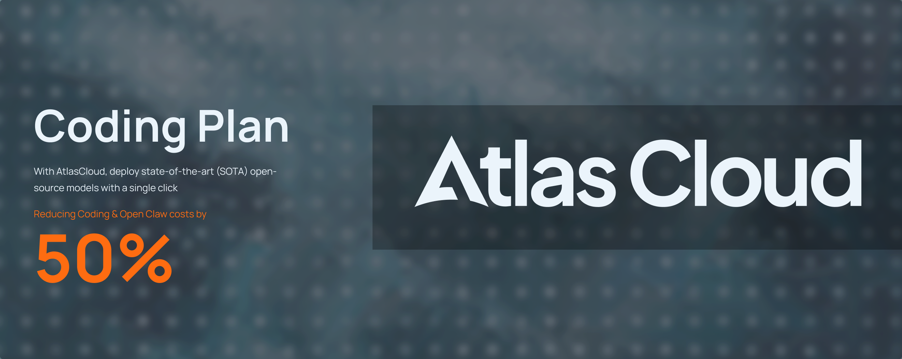

# Course Code

Course Code is an open-source coding-agent CLI for cloud and local model providers.

Use OpenAI-compatible APIs, Gemini, GitHub Models, Ollama, and other backends while keeping one terminal-first workflow: prompts, tools, agents, MCP, slash commands, and streaming output.

[](https://github.com/RennKaeo/Courze/actions/workflows/pr-checks.yml)
[](https://github.com/RennKaeo/Courze/tags)
[](https://github.com/RennKaeo/Courze/discussions)
[](https://discord.gg/k68zFR6AcB)
[](SECURITY.md)
[](LICENSE)

[Quick Start](#quick-start) | [Setup Guides](#setup-guides) | [Providers](#supported-providers) | [Source Build](#source-build-and-local-development) | [VS Code Extension](#vs-code-extension) | [Community](#community)

## Sponsors

<table align="center">
  <tr>
    <td align="center" width="150" height="80">
      <a href="https://bankr.bot">
        
      </a>
    </td>
    <td align="center" width="150" height="80">
      <a href="https://atomic.chat/">
        
      </a>
    </td>
    <td align="center" width="150" height="80">
      <a href="https://mimo.mi.com">
        
      </a>
    </td>
    <td align="center" width="150" height="80">
      <a href="https://www.atlascloud.ai/">
        
      </a>
    </td>
  </tr>
  <tr>
    <td align="center"><a href="https://bankr.bot"><strong>Bankr.bot</strong></a></td>
    <td align="center"><a href="https://atomic.chat/"><strong>Atomic Chat</strong></a></td>
    <td align="center"><a href="https://mimo.mi.com"><strong>Xiaomi MiMo</strong></a></td>
    <td align="center"><a href="https://www.atlascloud.ai/"><strong>Atlas Cloud</strong></a></td>
  </tr>
</table>

## Star History

[](https://www.star-history.com/?repos=RennKaeo%2FCourze&type=date&legend=top-left)

## Why Course Code

- Use one CLI across cloud APIs and local model backends
- Save provider profiles inside the app with `/provider`
- Run with OpenAI-compatible services, Gemini, GitHub Models, Ollama, and other supported providers
- Keep coding-agent workflows in one place: bash, file tools, grep, glob, agents, tasks, MCP, and web tools
- Use the bundled VS Code extension for launch integration and theme support

## Quick Start

### Install

**Automatic install (recommended):**

```bash
curl -fsSL https://raw.githubusercontent.com/RennKaeo/Courze/main/install.sh | bash
```

This installs Bun if needed, clones the repo, builds, and adds `course` to your PATH.

**Manual source build:**

```bash
git clone https://github.com/RennKaeo/Courze.git
cd Courze
bun install
bun run build
npm link
```

If you're on Arch Linux, you can install from the community-maintained [AUR package](https://aur.archlinux.org/packages/course):
```bash
paru -S course
```

If the install later reports `ripgrep not found`, install ripgrep system-wide and confirm `rg --version` works in the same terminal before starting Course Code.

**Verify installed version:**

```bash
course --version
```

### Start

```bash
course
```

Inside Course Code:

- run `/provider` for guided provider setup and saved profiles
- run `/onboard-github` for GitHub Models onboarding

> **Note:** Course Code does not automatically load project `.env` files. We recommend using the `/provider` command for setup, which saves provider profiles and credentials in `.courzerc.json`. If you prefer environment variables, export them explicitly or run `course --provider-env-file .env` for provider/setup variables. Export runtime/debug knobs from your shell or launcher.

### Resume or fork a conversation

Resume an existing conversation by session ID, or continue the most recent
conversation in the current directory:

```bash
course --resume <session-id>
course --continue
```

Add `--fork-session` to branch the conversation history into a new session ID
instead of reusing the original transcript:

```bash
course --resume <session-id> --fork-session
course --continue --fork-session
```

Forking is conversation branching only. It does not create filesystem isolation,
copy your working tree, or create a git worktree branch.

### Background sessions

Run long non-interactive prompts detached from the current terminal:

```bash
course --bg "fix failing tests"
course --bg --name auth-refactor "refactor auth middleware"
course ps
course logs auth-refactor
course logs auth-refactor -f
course kill auth-refactor
```

Background sessions are local child processes. Course Code does not start a daemon
or network service, and permission/provider/model/settings flags are passed to
the child process the same way they are for a foreground `--print` run. Session
metadata and logs are stored under the resolved Course Code config directory,
usually `~/.course/bg-sessions/`; `COURSE_CONFIG_DIR` can point
Course Code somewhere else.

`course attach <id-or-name>` currently reports the matching session and
points to `course logs <id> -f`; full terminal reattach is not implemented
for local background sessions yet.

### Fastest OpenAI setup

macOS / Linux:

```bash
export COURSE_USE_OPENAI=1
export OPENAI_API_KEY=sk-your-key-here
export OPENAI_MODEL=gpt-4o

course
```

Windows PowerShell:

```powershell
$env:COURSE_USE_OPENAI="1"
$env:OPENAI_API_KEY="sk-your-key-here"
$env:OPENAI_MODEL="gpt-4o"

course
```

### Fastest local Ollama setup

macOS / Linux:

```bash
export COURSE_USE_OPENAI=1
export OPENAI_BASE_URL=http://localhost:11434/v1
export OPENAI_MODEL=qwen2.5-coder:7b

course
```

Windows PowerShell:

```powershell
$env:COURSE_USE_OPENAI="1"
$env:OPENAI_BASE_URL="http://localhost:11434/v1"
$env:OPENAI_MODEL="qwen2.5-coder:7b"

course
```

For Ollama, Course Code uses Ollama's native chat API and requests a 32768-token
context window on each chat request so same-session history is not silently
truncated by Ollama's OpenAI-compatible shim. Set `COURSE_OLLAMA_NUM_CTX`
if you need a different request-level context size.
See [Advanced Setup](docs/advanced-setup.md#ollama-context-length) for
verification with `ollama ps`.

## Setup Guides

Beginner-friendly guides:

- [Non-Technical Setup](docs/non-technical-setup.md)
- [Windows Quick Start](docs/quick-start-windows.md)
- [macOS / Linux Quick Start](docs/quick-start-mac-linux.md)

Advanced and source-build guides:

- [Advanced Setup](docs/advanced-setup.md)
- [Android Install](ANDROID_INSTALL.md)

## Supported Providers

| Provider | Setup Path | Notes |
| --- | --- | --- |
| OpenAI-compatible | `/provider` or env vars | Works with OpenAI, OpenRouter, DeepSeek, Groq, Mistral, LM Studio, and other compatible `/v1` servers |
| Z.AI GLM Coding Plan | `/provider` or OpenAI-compatible env vars | Uses `OPENAI_API_KEY` at `https://api.z.ai/api/coding/paas/v4` and defaults to `glm-5.2` |
| Hicap | `/provider` or OpenAI-compatible env vars | Uses `api-key` auth, discovers models from unauthenticated `/models`, and supports Responses mode for `gpt-` models |
| Fireworks AI | `/provider` or env vars | 276 curated models (DeepSeek, Qwen, Llama, Gemma, and more); uses `FIREWORKS_API_KEY` |
| ClinePass | `/provider` or env vars | AI model gateway with usage limits; uses `CLINE_API_KEY` at `https://api.cline.bot/api/v1` |
| Gemini | `/provider` or env vars | Supports API key only |
| GitHub Models | `/onboard-github` | Interactive onboarding with saved credentials |
| Ollama | `/provider` or env vars | Local inference with no API key |
| Atomic Chat | `/provider`, env vars, or `bun run dev:atomic-chat` | Local Model Provider; auto-detects loaded models |
| OpenCode Zen | `/provider` or env vars | Pay-as-you-go AI gateway (48 models); uses `OPENCODE_API_KEY` via `https://opencode.ai/zen/v1` |
| OpenCode Go | `/provider` or env vars | $10/mo subscription for open models (13 models); uses `OPENCODE_API_KEY` via `https://opencode.ai/zen/go/v1` |
| Xiaomi MiMo | `/provider` or env vars | OpenAI-compatible API at `https://mimo.mi.com`; uses `MIMO_API_KEY` and defaults to `mimo-v2.5-pro` |
| NEAR AI | `/provider` or env vars | Unified gateway (Claude, GPT, Gemini + TEE open models); uses `NEARAI_API_KEY` at `https://cloud-api.near.ai/v1` |
| Bedrock / Vertex / Foundry | env vars | Anthropic-family cloud routes |

## What Works

- **Tool-driven coding workflows**: Bash, file read/write/edit, grep, glob, agents, tasks, MCP, and slash commands
- **Streaming responses**: Real-time token output and tool progress
- **Tool calling**: Multi-step tool loops with model calls, tool execution, and follow-up responses
- **Images**: URL and base64 image inputs for providers that support vision
- **Provider profiles**: Guided setup plus saved user-level provider profile support
- **Local and remote model backends**: Cloud APIs, local servers, and Apple Silicon local inference

## Provider Notes

Course Code supports multiple providers, but behavior is not identical across all of them.

- Provider-specific features may not exist on all backends
- Tool quality depends heavily on the selected model
- Smaller local models can struggle with long multi-step tool flows
- Some providers impose lower output caps than the CLI defaults, and Course Code adapts where possible
- Xiaomi MiMo uses `api-key` header auth on the direct OpenAI-compatible route and currently does not support `/usage` reporting in Course Code

### GitHub Copilot sub-agent optimization

When `COURSE_USE_GITHUB=1`, Course Code serializes sub-agent execution to reduce GitHub Copilot Premium Request consumption. Default behavior is `GITHUB_COPILOT_MAX_SUBAGENTS=1` (synchronous, one sub-agent at a time). Tuning vars (all optional):

| Var | Effect |
|---|---|
| GITHUB_COPILOT_MAX_SUBAGENTS=0 | Suppress sub-agents entirely (sub-agents throw an error). |
| GITHUB_COPILOT_MAX_SUBAGENTS=1 | Force synchronous execution. **Default.** |
| GITHUB_COPILOT_MAX_SUBAGENTS=2..10 | Parsed/clamped but not enforced differently from =1 (any positive cap = synchronous). |
| GITHUB_COPILOT_ALLOW_SUBAGENTS=1 | Re-enable parallel/background sub-agents, overriding the cap. |
| GITHUB_COPILOT_FORCE_SYNC_SUBAGENTS=1 | Force synchronous execution regardless of cap. |
| GITHUB_COPILOT_OPTIMIZATION_DISABLED=1 | Disable all of the above; sub-agents run as before this feature. |

The `is_async` field reported in the `courze_agent_tool_selected` event and the agent metadata now reflects the final execution mode (i.e., `false` when synchronous is forced). See `.env.example` for the full descriptions.

For best results, use models with strong tool/function calling support.

### Agent step limits

Custom agents can define `maxSteps` as a positive integer to cap how many tool-use steps a sub-agent may execute. When the limit is reached, Course Code stops additional tool calls and asks the sub-agent for a concise final summary covering completed work, findings, remaining tasks, and whether another run is needed. Omitting `maxSteps`, or setting it to an invalid value such as `0` or malformed input, preserves the default unlimited behavior.

```markdown
---
name: bounded-researcher
description: Use for focused research with bounded tool use
maxSteps: 8
---

You are a focused research agent.
```

## Agent Routing

Course Code can route different agents to different models through settings-based routing. This is useful for cost optimization or splitting work by model strength.

Add to `~/.course.json`:

```json
{
  "agentModels": {
    "deepseek-v4-flash": {
      "base_url": "https://api.deepseek.com/v1",
      "api_key": "sk-your-key"
    },
    "zai-default": {
      "model": "glm-5.2",
      "base_url": "https://api.z.ai/api/coding/paas/v4",
      "api_key": "sk-your-key"
    },
    "gpt-4o": {
      "base_url": "https://api.openai.com/v1",
      "api_key": "sk-your-key"
    }
  },
  "agentRouting": {
    "Explore": "deepseek-v4-flash",
    "Plan": "gpt-4o",
    "general-purpose": "gpt-4o",
    "frontend-dev": "zai-default",
    "default": "gpt-4o"
  }
}
```

When no routing match is found, the global provider remains the fallback.

`agentRouting` values and explicit Agent tool `model` overrides match keys in `agentModels`. By default, that key is also the model string sent to the provider. Set `agentModels.<key>.model` when you want a local route key such as `zai-default` to call a different provider model name such as `glm-5.2`.

> **Note:** `/provider` changes the global/parent provider for your current session. `agentModels` and `agentRouting` are specifically for configuring per-agent provider overrides while keeping the parent session unchanged.

> **Note:** `api_key` values in `settings.json` are stored in plaintext. Keep this file private and do not commit it to version control.

**Model-only routes (same provider):** Omit `base_url` and `api_key` to run an agent on a different model using your *current* provider's endpoint and key — no credential duplication:

```json
{
  "agentModels": {
    "mini": { "model": "gpt-5-mini" }
  },
  "agentRouting": {
    "verification": "mini"
  }
}
```

**Built-in agents are routable by their type name.** Useful keys: `verification` (the read-only auditor that runs before completion), `Explore`, and `Plan`. For example, `"agentRouting": { "verification": "mini" }` runs the verifier on `gpt-5-mini` while your main session stays on its model. Absent any entry, the verifier inherits the main-loop model.

## Web Search and Fetch

By default, `WebSearch` works on non-Anthropic models using DuckDuckGo. This gives GPT-4o, DeepSeek, Gemini, Ollama, and other OpenAI-compatible providers a free web search path out of the box.

> **Note:** DuckDuckGo fallback works by scraping search results and may be rate-limited, blocked, or subject to DuckDuckGo's Terms of Service. If you want a more reliable supported option, configure Firecrawl.

For Anthropic-native backends, Course Code keeps the native provider web search behavior.

`WebFetch` works, but its basic HTTP plus HTML-to-markdown path can still fail on JavaScript-rendered sites or sites that block plain HTTP requests.

Set a [Firecrawl](https://firecrawl.dev) API key if you want Firecrawl-powered search/fetch behavior:

```bash
export FIRECRAWL_API_KEY=your-key-here
```

With Firecrawl enabled:

- `WebSearch` can use Firecrawl's search API while DuckDuckGo remains the default free path for non-Claude models
- `WebFetch` uses Firecrawl's scrape endpoint instead of raw HTTP, handling JS-rendered pages correctly

Free tier at [firecrawl.dev](https://firecrawl.dev) includes 500 credits. The key is optional.

---

## Headless gRPC Server

Course Code can be run as a headless gRPC service, allowing you to integrate its agentic capabilities (tools, bash, file editing) into other applications, CI/CD pipelines, or custom user interfaces. The server uses bidirectional streaming to send real-time text chunks, tool calls, and request permissions for sensitive commands.

### 1. Start the gRPC Server

Start the core engine as a gRPC service on `localhost:50051`:

```bash
npm run dev:grpc
```

#### Configuration

| Variable | Default | Description |
|-----------|-------------|------------------------------------------------|
| `GRPC_PORT` | `50051` | Port the gRPC server listens on |
| `GRPC_HOST` | `localhost` | Bind address. Use `0.0.0.0` to expose on all interfaces (not recommended without authentication) |

### 2. Run the Test CLI Client

We provide a lightweight CLI client that communicates exclusively over gRPC. It acts just like the main interactive CLI, rendering colors, streaming tokens, and prompting you for tool permissions (y/n) via the gRPC `action_required` event.

In a separate terminal, run:

```bash
npm run dev:grpc:cli
```

*Note: The gRPC definitions are located in `src/proto/course.proto`. You can use this file to generate clients in Python, Go, Rust, or any other language.*

---

## Source Build And Local Development

Use Node.js `>=22.0.0` and Bun `1.3.13` or newer for source builds.

```bash
bun install
bun run build
node dist/cli.mjs
```

Helpful commands:

- `bun run dev`
- `bun test`
- `bun run test:coverage`
- `bun run smoke`
- `bun run doctor:runtime`
- focused `bun test ...` runs for the areas you touch

## Testing And Coverage

Course Code uses Bun's built-in test runner for unit tests.

Run the full unit suite:

```bash
bun test
```

Generate unit test coverage:

```bash
bun run test:coverage
```

Open the visual coverage report:

```bash
open coverage/index.html
```

If you already have `coverage/lcov.info` and only want to rebuild the UI:

```bash
bun run test:coverage:ui
```

Use focused test runs when you only touch one area:

- `bun run test:provider`
- `bun run test:provider-recommendation`
- `bun test path/to/file.test.ts`

Recommended contributor validation before opening a PR:

- `bun run build`
- `bun run smoke`
- `bun run test:coverage` for broader unit coverage when your change affects shared runtime or provider logic
- focused `bun test ...` runs for the files and flows you changed

Coverage output is written to `coverage/lcov.info`, and Course Code also generates a git-activity-style heatmap at `coverage/index.html`.

## Repository Structure

- `src/` - core CLI/runtime
- `scripts/` - build, verification, and maintenance scripts
- `docs/` - setup, contributor, and project documentation
- `vscode-extension/course-vscode/` - VS Code extension
- `.github/` - repo automation, templates, and CI configuration
- `bin/` - CLI launcher entrypoints

## VS Code Extension

The repo includes a VS Code extension in [`vscode-extension/course-vscode`](vscode-extension/course-vscode) for Course Code launch integration, provider-aware Control Center, in-editor chat, theme support, and optional **Microsoft Foundry / Azure OpenAI** configuration (endpoint, API version, deployment, API key via Secret Storage) injected into launched terminals. See that folder's [README](vscode-extension/course-vscode/README.md).

## Security

If you believe you found a security issue, see [SECURITY.md](SECURITY.md).

## Community

- Use [GitHub Discussions](https://github.com/RennKaeo/Courze/discussions) for Q&A, ideas, and community conversation
- Use [GitHub Issues](https://github.com/RennKaeo/Courze/issues) for confirmed bugs and actionable feature work
- Join the [Discord](https://discord.gg/k68zFR6AcB) to chat with the community in real time

## Contributing

Contributions are welcome.

For larger changes, open an issue first so the scope is clear before implementation. Helpful validation commands include:

- `bun run build`
- `bun run test:coverage`
- `bun run smoke`
- focused `bun test ...` runs for files and flows you changed

## License

MIT. See [LICENSE](LICENSE) for details.
